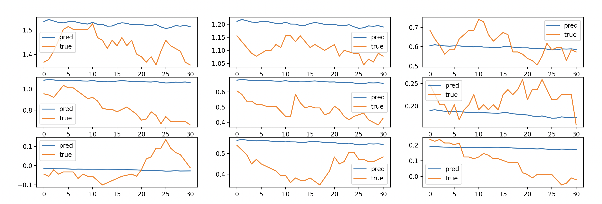

# BITAMIN Conference: Finance Team 

Repository for **Bitamin 9th Finance Conference**

## Abstract

비타민 9기 Conference를 위한 Repository입니다.

## How to Run

### 시작하기
```shell
git clone https://github.com/orange-fritters/finance-conference.git
cd finance-conference
pip install -r requirements.txt
```
### 모델 작성
1. `src/model`에 모델을 `pytorch` 모델을 작성합니다.
    - 단, 모델의 input은 args로 받아 할당합니다.
    - EX 
   ```python
    class LSTM(nn.Module):
        def __init__(self, args):
            super(LSTM, self).__init__()
            self.num_layers = args.num_layers
            self.hidden_size = args.hidden_size
    ```
2. `src/train_files/serial_forecasting/lightning_train.py` 에 해당 모델을 `import` 합니다.
    - EX
   ```python
    from src.model.NBeats import NBeats
    ```
3. `src/train_files/serial_forecasting/lightning_train.py` 의 18번째 line에 key-value 형태로 모델을 등록합니다.
    - EX 
   ```python
    models = {'nbeats': NBeats}
   ```
4. `train.py`에 model의 argument를 추가합니다. 
    - EX 
   ```python
    # forecasting task NLinear
    parser.add_argument('--seq_len', type=int, default=96 * 4, help='input sequence length')
    parser.add_argument('--label_len', type=int, default=48, help='start token length')
    parser.add_argument('--pred_len', type=int, default=96, help='prediction sequence length')

    # forecasting task LSTM
    parser.add_argument('--hidden_size', type=int, default=256, help='hidden size')
    parser.add_argument('--num_layers', type=int, default=3, help='num layers')
    parser.add_argument('--dropout', type=float, default=0.2, help='dropout')
   ```

### test.sh 사용법
```shell
cd ../../
pwd

venv/bin/python train.py \             # 사용하는 python interpreter 경로로 바꿔주고
  --model_id lstm \                    # 모델의 이름
  --model_type lstm \                  # 모델의 타입 lstm, nbeats, nlinear 등등 key-value로 등록한 값
  --model_arch_desc test \             # 모델의 간단한 설명, 모델 결과 directiry  이름이 됩니다
  --data_path data/forex/t_note.csv \  # 데이터 경로
  --accelerator cpu \                  # cpu or mps (맥인 경우) gpu (사용시 혹은 코랩)
  --num_layers 5 \                     # model의 argument (모델 작성시 추가한 argument)
  --hidden_size 512 \                  # model의 argument (모델 작성시 추가한 argument)
  --epoch 10 \                         # epoch
  --seq_len 96 \                       # input sequence 길이
  --pred_len 31 \                      # prediction sequence 길이
  --label_len 10 \                     # start token 길이 (transformer의 경우)
  --learning_rate 0.0001 \             # learning rate
  --weight_decay 0.0001 \              # weight decay
  --scale False
```
- 자세한 사항은 `tests/mindong/mindong_test.sh` 참고
- `sh` 사용으로 실험을 여러번 편하게 할 수 있음!
- 실행 결과로 test_set에 대한 예측 결과가 띄워짐



### Directory Structure

```
├──  data
│    ├── api_codes
│    └── crypto
│       ├── btc_data_5min.csv
│       └── btc_data_15min.csv
│    └── forex ... train the model
│       ├── dow.csv
│       ├── exchange_rate.csv
│       ├── fund_rate.csv
│       ├── nasdaq.csv
│       ├── t_note.csv
│       └── sp500.csv
│    └── stocks
│       ├── aapl.csv
│       ├── amzn.csv
│       ├── goog.csv
│       ├── meta.csv
│       ├── msft.csv
│       ├── nflx.csv
│       └── tsla.csv
│
├──  src
│    └── dataloader
│       ├── dataloader.py
│       └── dataset.py
│    └── lightning_logs
│       └── arima
│          ├── test
│          └── exp_1
│       └── lstm
│          ├── test
│          └── 2_layer
│       └── nlinear
│          ├── test
│          └── long_seq
│    └──model
│       ├── ARIMA.py
│       ├── LSTM.py
│       └── NLinear.py
│
│    └── train_files
│       └── reinforecement_learning
│       └── serial_forecasting
│          ├── lignthning_train.py
│          └── LitModel.py
│    └── train_src.py
│    
│    └── utils
│       ├── eda.ipynb
│       ├── backtesting.py
│       ├── logger.py
│       ├── metrics.py
│       └── visualizer.py
│
│    └── tests
│       └── mindong
│          └── mindong_test.sh
│       └── name2
│          └── name2_test.sh
│       └── name3
│          └── name3_test.sh
│       └── name4
│          └── name4_test.sh
│
├──  .gitignore
├──  train.py
├──  requirements.txt
├──  TODOs.md
└──  README.md
```